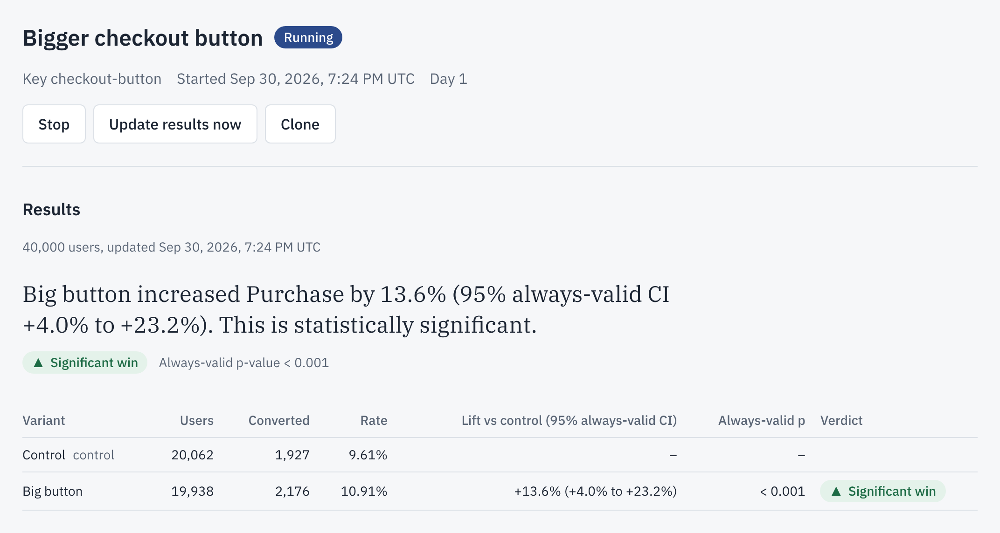
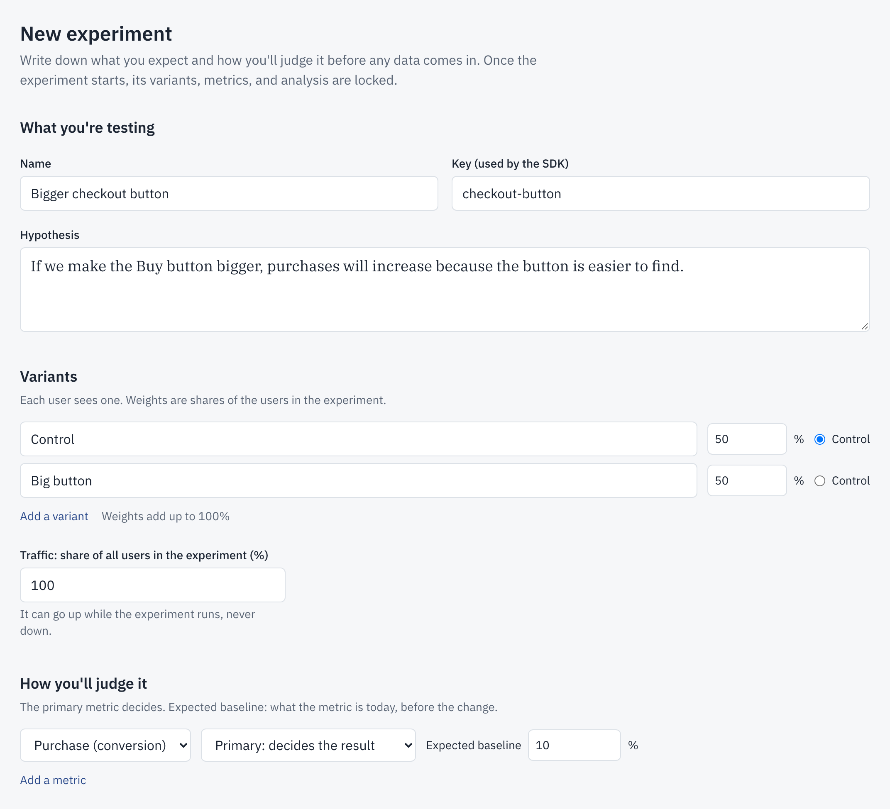
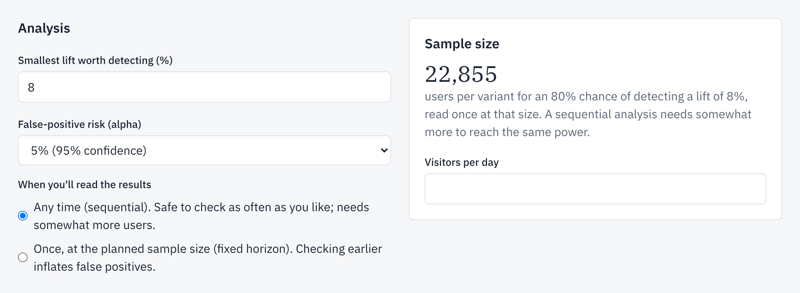
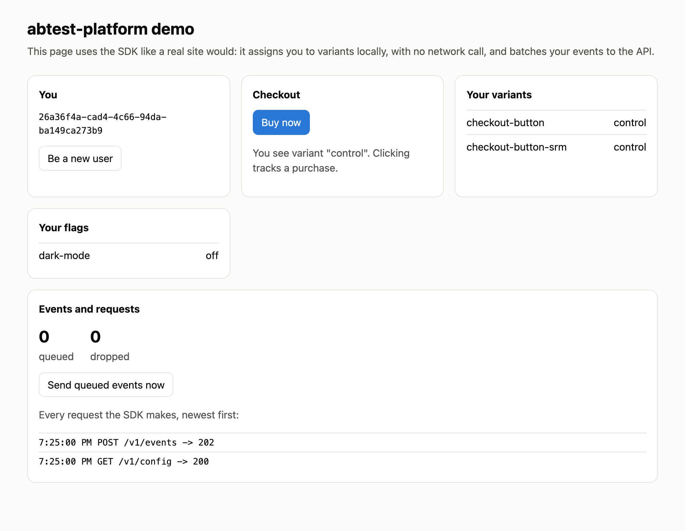
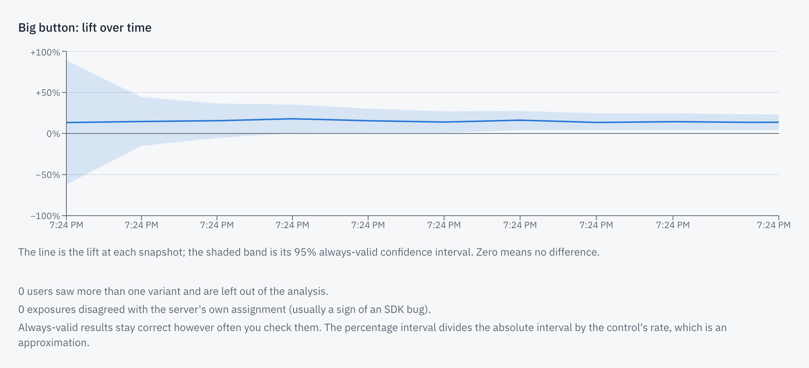
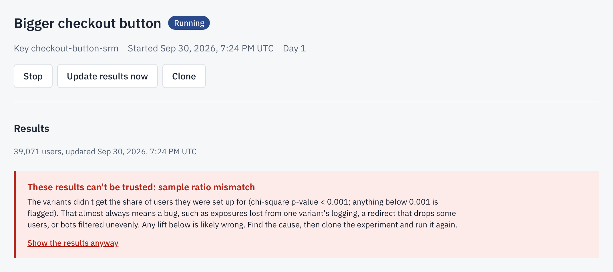
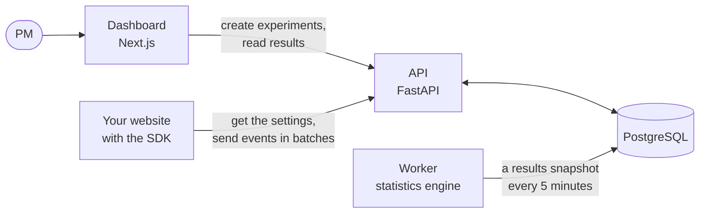
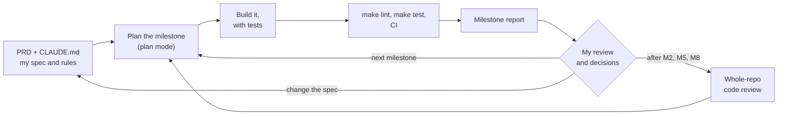

# abtest-platform

An A/B-testing platform that tells a product team whether a change worked, and warns them when the answer can't be trusted.

[](https://github.com/yengnongxiong/abtest-platform/actions/workflows/ci.yml)



**[The problem](#the-problem) · [What it does](#what-it-does) · [Walkthrough](#walkthrough) · [Results](#results) · [Built for users](#built-for-users) · [How it works](#how-it-works) · [Technical choices](#technical-choices) · [How it was made](#how-it-was-made) · [Run it locally](#run-it-locally) · [PRD](docs/PRD.md) · [Experiment memo](docs/experiment-memo-example.md)**

## The problem

Product teams decide what to ship with A/B tests, and three common mistakes turn them into confident wrong answers: stopping at the first good-looking result (peeking), a bug that sends the variants unequal traffic (a sample ratio mismatch), and counting purchases made before a user saw the change. In this project's simulation of 20,000 tests where nothing had changed, peeking 20 times found a difference that wasn't there 24.6% of the time, instead of the promised 5%. Platforms such as GrowthBook and Statsig build in safeguards like these, but to most people who use them, the safeguards are a black box. I built this to understand experimentation from the inside, not to compete with them: every safeguard here is implemented, tested, and measured.

## What it does

- **Assigns each visitor to a variant** in the browser, with a 2,556-byte SDK and no network call per decision.
- **Collects events in batches**, so a retried batch is never counted twice.
- **Computes results every 5 minutes** with a test that stays valid however often someone checks, and states them in one plain sentence.
- **Hides the results behind a warning** when the variants' traffic split doesn't match the plan.
- **Checks its own statistics** by running thousands of simulated experiments whose true answer is known.

## Walkthrough

A real run of the local stack with simulated users; [`make screenshots`](scripts/screenshots.py) retakes every image.

### 1. Write down the hypothesis before any data arrives



An experiment starts as a pre-registration: the hypothesis, the variants and their split, and the one metric that decides. Once it starts, the design is locked.

### 2. Know how many users the test needs



22,855 users per variant give an 80% chance of detecting an 8% lift from a 10% baseline. The default, "Any time (sequential)", needs somewhat more users and can be checked as often as you like.

### 3. Visitors get their variant from the SDK



The demo page uses the SDK like a real site: it picks the visitor's variant in the browser and sends events in batches. For the results below, the traffic generator sent 40,000 simulated users the same way, with a true +8% lift built in.

### 4. Read the verdict

The screenshot at the top of this page is the verdict. Its interval, +4.0% to +23.2%, contains the true +8%.



Each point is one look while the users arrived; the band narrows as data comes in. The simulation sends its users in about 20 seconds, so every look falls in the same minute.

### 5. Catch a broken experiment



A copy of the test gets a logging bug that loses 5% of one variant's exposures. The users split 20,057 to 19,014 instead of evenly, so the dashboard hides the results behind a warning.

## Results

Every number comes from a command run in this repo.

| What was measured | Result | Source |
|---|---|---|
| 20,000 simulated tests with no real difference, checked 20 times, stopped at the first p < 0.05 | **24.62%** false positives (promised: 5%) | [docs/results/summary.md](docs/results/summary.md) |
| The same, with the sequential test (the dashboard's default) | **0.90%** | same |
| The same, checked once at the planned size | 4.86% (a correct test lands in 4.70% to 5.30%) | same |
| The price of checking any time | 1.75 to 1.88 times the users for 80% power | same |
| 40,000 simulated users with a true +8% lift, through the real API and worker | +13.6%, 95% always-valid CI **+4.0% to +23.2%** (contains +8%) | [docs/experiment-memo-example.md](docs/experiment-memo-example.md) |
| The same test, losing 5% of one variant's exposures | Mismatch flagged: 20,057 vs 19,014 users, p = 1.3 × 10⁻⁷ | `make screenshots` (the `srm_bug` scenario) |
| Ingestion through the API on a laptop (best run) | **17,198 events/s**, median request 18 ms | [docs/performance.md](docs/performance.md#6-load-test-the-ingestion-api-under-locust) |
| Attribution query: 300,121 users, 10 million events | **299 ms** (437 ms with no index) | [docs/performance.md](docs/performance.md#3-the-attribution-query-before-and-after-its-indexes) |
| SDK size | **2,556 bytes** min+gzip, zero dependencies | `cd sdk-js && npm run build && npm run size` |


<details>
<summary>The price of checking any time: power curves</summary>


The sequential test detects a real lift less often at the same size, and needs 1.75 to 1.88 times the users to catch up. The fixed-horizon test matches its theoretical curve. The [sample ratio mismatch](docs/results/srm.png) and [skewed-revenue](docs/results/welch_skewed.png) charts are in [docs/results/](docs/results/summary.md).
</details>

The [experiment memo](docs/experiment-memo-example.md) writes up the +8% run as a PM would, including why two of three runs of the same test overstated the lift.

## Built for users

| Decision | Why it helps the user |
|---|---|
| The form asks for a hypothesis, one primary metric, and the smallest lift worth detecting, and locks them at the start | The team agrees on what success means before seeing data, so nobody moves the goalposts |
| The form shows the sample size live | The PM knows how many users the test needs before committing |
| Results lead with one sentence and a verdict chip, with signed bounds ("−1.0% to +17.8%") | Readable without statistics, and an interval that crosses zero stands out |
| "Any time (sequential)" is the default analysis | People check dashboards constantly, and the default stays correct when they do (0.90% false positives, against 24.62% for peeking) |
| A sample ratio mismatch hides the results behind a red banner | A team can't ship on data a logging bug broke, but can still look ("Show the results anyway") |

## How it works



A PM designs and starts experiments in the dashboard. A website loads the experiment settings through the SDK, which assigns each visitor to a variant in the browser and reports what they saw and did. Every 5 minutes, a worker matches each purchase to the variant its user saw, runs the statistics, and saves a snapshot for the dashboard to show. Everything is stored in one PostgreSQL database. [docs/architecture.md](docs/architecture.md) has the details.

## Technical choices

Each row links to its decision record, which lists the alternatives and the costs. [docs/architecture.md](docs/architecture.md#design-decisions) has the full list.

**Languages and frameworks**

| Choice | What it does | Why it beat the main alternative |
|---|---|---|
| Python 3.14, FastAPI, Pydantic v2 | The API; every request is checked against a typed model | Synchronous handlers share one set of queries with the worker and tests; an async API would need an async worker too, or a second copy ([ADR-002](docs/decisions.md#adr-002-synchronous-database-access-m0)) |
| TypeScript SDK, zero dependencies | Runs on the website: picks variants, sends events | 2,556 bytes with nothing for a site to audit; hand-written hashing checked against Python with 129 shared vectors ([ADR-011](docs/decisions.md#adr-011-flags-and-experiments-are-evaluated-in-the-sdk-not-on-the-server-m4)) |
| Next.js, Tailwind, Recharts | The dashboard | Pages render on the server, so the admin key never reaches a browser ([ADR-019](docs/decisions.md#adr-019-dashboard-auth-one-password-a-signed-cookie-and-the-server-key-kept-on-the-server-m8)) |

**Data storage**

| Choice | What it does | Why it beat the main alternative |
|---|---|---|
| PostgreSQL as the only store | Holds settings, events, and results | Transactions let the API answer "stored" or "duplicate" per event; a queue plus a warehouse adds two systems to run ([ADR-007](docs/decisions.md#adr-007-postgresql-alone-not-a-columnar-store-or-a-queue-m3)) |
| One partition per day for events | A query reads only the days it needs | The large experiment reads 4 of 22 partitions; one table would mean searching an ever-growing index ([ADR-008](docs/decisions.md#adr-008-daily-partitions-and-the-partition-key-in-the-primary-key-m3)) |
| A covering index, found with `EXPLAIN` | Answers attribution from the index alone | 299 ms and 12,138 pages read, against 372 ms and 83,746 with the first index ([ADR-021](docs/decisions.md#adr-021-a-covering-attribution-index-and-a-query-bounded-on-both-sides-m9)) |
| Results saved as snapshots | A page load reads a stored result | One indexed read instead of scanning events, and the series is the history the sequential test needs ([ADR-018](docs/decisions.md#adr-018-results-are-precomputed-snapshots-not-computed-on-read-m7)) |

**Algorithms and data structures**

| Choice | What it does | Why it beat the main alternative |
|---|---|---|
| MurmurHash3 buckets, two independent hashes | Same variant for a user every time, with nothing stored | With one hash, raising traffic would move users between variants ([ADR-012](docs/decisions.md#adr-012-two-independent-hashes-one-for-inclusion-one-for-the-variant-m4)) |
| mSPRT, a sequential test | Results stay valid however often someone checks | Group-sequential designs fix the number of checks in advance ([ADR-005](docs/decisions.md#adr-005-sequential-testing-with-msprt-and-how-%CF%84-is-chosen-m1)) |
| Chi-square test for sample ratio mismatch | Flags a traffic split that doesn't match the plan | The standard check; its false alarms over repeated checks are measured (see Limitations) |
| Monte Carlo with binomial draws | Runs simulated experiments through the real statistics code | Same distribution as simulating each user, far faster: the whole validation takes 32 s on a laptop ([ADR-006](docs/decisions.md#adr-006-how-the-monte-carlo-validation-simulates-and-judges-m2)) |

**System design**

| Choice | What it does | Why it beat the main alternative |
|---|---|---|
| Variants decided in the SDK | No network call when a page asks for a variant | A server call per decision slows the page; the server still re-checks each assignment ([ADR-011](docs/decisions.md#adr-011-flags-and-experiments-are-evaluated-in-the-sdk-not-on-the-server-m4)) |
| At-least-once delivery, deduplicated by the server | A retried event is counted once | Exactly-once in the browser is much more code and still fails across tabs ([ADR-014](docs/decisions.md#adr-014-how-the-sdk-delivers-events-at-least-once-deduplicated-by-the-server-m5)) |
| Transaction-scoped advisory locks | Two workers never run the same job | Released when the transaction ends, so they can't leak ([ADR-017](docs/decisions.md#adr-017-advisory-locks-for-the-workers-jobs-and-for-results-m7)) |

## How it was made

I built this with Claude Code, in the CLI, the desktop app, and the web version. I wrote the spec and the rules and made the judgment calls; Claude Code wrote the code, tests, and docs, one milestone at a time.



- **Context engineering.** Every session starts from the [PRD](docs/PRD.md) (what to build; the agent must stop and ask rather than deviate), [CLAUDE.md](CLAUDE.md) (how to work), and the [decision log](docs/decisions.md) (why things are the way they are). I drafted the PRD and CLAUDE.md with an AI chat, then edited them.
- **Agent orchestration.** 11 milestones (M0 to M10), each planned in plan mode from prompts I wrote, then built, checked, committed, and reported. The agent used subagents, the agent-browser skill to click through the dashboard in a real Chrome, and context7 for current library docs.
- **Quality control.** Tests are written with the code, and every bug fix gets a regression test. Rules are enforced by checks, not trust (table below), and the whole repo was reviewed after M2, M5, and M8, and in a final health check.
- **Product judgment.** The calls where I overruled or redirected the agent:
  - Kickoff: I answered the design questions from its PRD review myself, such as giving each metric its own sequential-test setting so secondary metrics keep their power ([PRD v1.1](docs/PRD.md#v11--kickoff-review-2026-09-27)).
  - M9: when the 10-million-event load tests made my fanless laptop very hot, I stopped them and kept the measurements already taken ([performance.md](docs/performance.md#1-setup)).
  - M10: I dropped the planned hosted deployment: no budget, and visitors would see only a sign-in page ([ADR-022](docs/decisions.md#adr-022-no-hosted-deployment-the-local-stack-is-the-demo-m10)).
  - After one very long session produced worse code, I changed how sessions run ([CLAUDE.md](CLAUDE.md#how-we-work)).

| What I did | What Claude Code did |
|---|---|
| Drafted the spec and rules, with an AI chat's help | Reviewed the spec at kickoff and listed its gaps |
| Made the design and scope calls above | Wrote the code, SQL, tests, and docs, and an ADR for each design decision |
| Wrote the prompts that start each milestone and review | Looked up versions; ran the simulations, measurements, and browser checks |
| Read every milestone report and decided what came next | Reviewed the whole repo and fixed what it found, with regression tests |

| Technique | How I used it | Evidence |
|---|---|---|
| A spec as the source of truth | Every change to the PRD is logged in its changelog | [docs/PRD.md](docs/PRD.md#24-changelog) |
| Written working rules | One milestone at a time, a test for every bug fix, never invent a number | [CLAUDE.md](CLAUDE.md) |
| Small, reviewable milestones | One commit per milestone, plus review fixes after M2, M5, and M8 | [Commit history](https://github.com/yengnongxiong/abtest-platform/commits/main) |
| Rules enforced by tests | The statistics engine can't import database, web, or I/O code; Python and TypeScript must match every hash vector | [test_stats_purity.py](server/tests/stats/test_stats_purity.py), [hash_test_vectors.json](shared/hash_test_vectors.json) |
| Numbers only from commands | Every number in the docs names the command that produced it | [docs/results/summary.md](docs/results/summary.md), [docs/performance.md](docs/performance.md) |
| Continuous integration | Lint, type checks, tests, the SDK size budget, and a full-stack start on every push | [ci.yml](.github/workflows/ci.yml) |

**My Claude Code setup.** Plugins: superpowers (process skills such as planning, test-driven development, and systematic debugging, loaded by its session-start hook), code-review, code-simplifier, context7 (library docs through MCP), frontend-design, and skill-creator. Skills: agent-browser and find-skills. Built in: plan mode, subagents, Claude in Chrome, and memory. Command-line tools: the GitHub CLI, Docker, uv, npm, and make.

## Limitations and what's next

- **Recent users have had less time to convert,** so rates read low while a test runs, equally for every variant ([ADR-016](docs/decisions.md#adr-016-how-events-are-attributed-and-the-limits-we-accept-m7)).
- **Event times come from the visitor's device clock,** which can be wrong.
- **No correction for multiple comparisons:** with many metrics, some look significant by chance, so the primary metric decides.
- **The sample ratio check repeats on every snapshot,** so false alarms grow: 0.11% at one check, 0.83% across 20.
- **Not deployed:** development images, one project, one admin password, and no sign-in rate limit ([ADR-022](docs/decisions.md#adr-022-no-hosted-deployment-the-local-stack-is-the-demo-m10)).

Next: a sample ratio check that stays valid across repeated checks, the PRD's [stretch goals](docs/PRD.md#23-stretch-goals) (such as CUPED variance reduction and holdout groups), and production images for a deployment.

## Run it locally

You need Docker with Compose (Docker Desktop, OrbStack, or Colima), `make`, and [uv](https://docs.astral.sh/uv/) for the simulated traffic.

```sh
git clone https://github.com/yengnongxiong/abtest-platform.git
cd abtest-platform
make dev                                  # builds and starts everything; leave it running
make traffic SCENARIO=checkout_button     # in a second terminal: 40,000 simulated users
```

Then open the dashboard at http://localhost:3000 and sign in with `ADMIN_PASSWORD` from `.env` (`make dev` creates it from `.env.example`). The SDK demo page is at http://localhost:8080, and the API's interactive docs at http://localhost:8000/docs.

<details>
<summary>All commands</summary>

| Command | What it does |
|---|---|
| `make setup` | Install the Python and Node dependencies on your machine (needs uv and Node 24) |
| `make dev` / `make down` | Start the stack / stop it |
| `make test` | Start Postgres, then run the Python tests (against a real Postgres) and the SDK tests. The dashboard's tests: `cd web && npm test` |
| `make lint` | ruff, mypy (strict), ESLint, and TypeScript checks |
| `make migrate` | Apply database migrations, and create the default project and API keys |
| `make simulate` | Run the Monte Carlo validation and regenerate `docs/results/` (about 30 s) |
| `make traffic SCENARIO=checkout_button` | Send simulated users through the running stack (see `scenarios/`), then print the results. `ARGS="--use-running --experiment-key <key>"` feeds an experiment started in the dashboard |
| `make seed EVENTS=10000000` | Fill a separate database, `abtest_perf`, with that many simulated events |
| `make perf` | Measure it: query plans for the attribution query, a worker look, the results read, and row-by-row vs batch inserts |
| `make loadtest` | Load-test the ingestion API with Locust, against `abtest_perf` |
| `make screenshots` | Retake the README's screenshots against an empty stack ([scripts/README.md](scripts/README.md)) |
</details>

## Repo map

| Path | What it holds |
|---|---|
| [server/](server) | Python: the API, the worker, the statistics engine, the simulator, and their tests |
| [sdk-js/](sdk-js) | The TypeScript SDK that websites use |
| [web/](web) | The Next.js dashboard |
| [demo/](demo) | A static page that uses the SDK like a real site |
| [db/](db) | SQL migrations for PostgreSQL |
| [docs/](docs) | The PRD, architecture, decision log, validation and performance results, and the experiment memo |
| [scenarios/](scenarios) | Inputs for the traffic generator |
| [loadtest/](loadtest) | Performance measurements and the load test |
| [shared/](shared) | Hash test vectors that Python and TypeScript must both match |
| [scripts/](scripts) | The screenshot generator |
| [.github/](.github/workflows/ci.yml) | The CI workflow |
| [LICENSE](LICENSE) | MIT |
