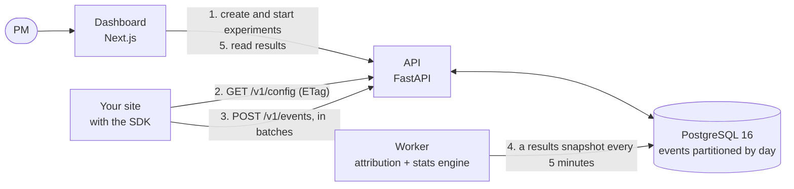

# abtest-platform

[](https://github.com/yengnongxiong/abtest-platform/actions/workflows/ci.yml)

A self-hostable feature-flag and A/B-testing platform, built to show that experiment results can be trusted. A zero-dependency TypeScript SDK assigns users to variants locally with deterministic hashing, and batches events to a FastAPI service backed by PostgreSQL. A Python worker attributes conversions and runs a statistics engine that guards against the classic mistakes: peeking (sequential testing with mSPRT), sample ratio mismatch, and bad attribution windows. A Monte Carlo simulator checks that those safeguards actually work, and a Next.js dashboard turns the results into plain-language verdicts a PM can act on. The full spec is in [docs/PRD.md](docs/PRD.md).

<!-- Demo recording: replace this block with the GIF, or with a video uploaded through GitHub's editor. -->
> **Demo recording: coming soon.** Until then, the [quickstart](#quickstart) runs the whole system on your machine with one command.

**At a glance** (every number below comes from a command run in this repo; the sections below give the command):
- **Peeking, measured.** In 20,000 simulated A/A tests (no real difference), a z-test checked at 20 looks and stopped at the first p < 0.05 declared a winner **24.6%** of the time, against the promised 5%. The sequential test the dashboard uses by default: **0.9%**.
- **Correct end to end.** Simulated users with a true +8% lift, sent through the real API, worker, and results endpoint, get an always-valid 95% CI of **+4.0% to +23.2%**, which contains the truth. A logging bug that loses 5% of one variant's exposures is flagged as a sample ratio mismatch (p = 1.3 × 10⁻⁷).
- **Measured on a laptop.** Up to **17,198 events/s** through the ingestion API (median request 18 ms). The attribution query for an experiment with 300,121 users, over 10 million events, takes **299 ms**.
- **A tiny SDK.** **2,556 bytes** min+gzip, zero dependencies. Its assignment is byte-identical to the server's Python, checked against 129 shared test vectors.

## Contents
[Quickstart](#quickstart) · [Architecture](#architecture) · [How it works](#how-it-works) · [Validation](#validation-do-the-statistics-work) · [Performance](#performance) · [Design decisions](#key-design-decisions) · [Limitations](#limitations-and-future-work) · [Security and privacy](#security-and-privacy) · [SDK](#using-the-sdk) · [Development](#development)

## Quickstart

Prerequisites: Docker with Compose (Docker Desktop, OrbStack, or Colima) and `make`.

```sh
git clone https://github.com/yengnongxiong/abtest-platform.git
cd abtest-platform
make dev
```

`make dev` creates `.env` from `.env.example` on first run, builds the images, migrates the database, and starts the stack. Source changes sync into the running containers (Docker Compose Watch). This was verified from a fresh clone on 2026-09-28, and CI builds and starts the whole stack on every push.

| Service | URL |
|---|---|
| Dashboard (password: `ADMIN_PASSWORD` in `.env`) | http://localhost:3000 |
| SDK demo page | http://localhost:8080 |
| API (interactive docs at `/docs`) | http://localhost:8000/health |
| PostgreSQL | `localhost:5432` (credentials in `.env`) |

### Run an experiment

Sending simulated users (`make traffic`) also needs [uv](https://docs.astral.sh/uv/) on your machine.

1. Sign in to the dashboard. Under **Metrics**, create a conversion metric that counts `purchase` events.
2. Under **Experiments → New experiment**, fill in the pre-registration form: a hypothesis, two variants named "Control" (the control) and "Big button", that metric as the primary one with a 10% expected baseline, and an 8% smallest lift worth detecting. It shows the sample size you'll need. Create it, then **Start** it.
3. Send 40,000 simulated users with a true +8% lift:
   ```sh
   make traffic SCENARIO=checkout_button ARGS="--use-running --experiment-key <its key>"
   ```
4. Reload the experiment's page to see the verdict, the plain-language sentence, the table, and the lift over time.
5. **Clone** the experiment, start the clone, and feed it `SCENARIO=srm_bug`, which loses 5% of one variant's exposures. A red banner hides the results, because they can't be trusted.

Or skip the dashboard: `make traffic SCENARIO=checkout_button` creates, starts, and feeds an experiment itself, then prints the results.

The demo page (http://localhost:8080) shows the SDK from a visitor's side: your variants and flags, a checkout button that follows the `checkout-button` experiment, and every request the SDK sends.

## Architecture



1. The dashboard calls the admin API (with a server key that stays on the dashboard's server). Every config change bumps the project's `config_version`.
2. The SDK fetches the config, with the version as its ETag, and assigns variants locally: no network call per decision.
3. The SDK sends exposures and events in batches. The API stores them, drops duplicates, and records each user's first exposure.
4. The worker attributes events to variants and runs the statistics engine, writing a results snapshot per metric.
5. The dashboard reads the snapshots.

| Component | Where | What it is |
|---|---|---|
| SDK | [sdk-js/](sdk-js) | TypeScript, zero runtime dependencies, browsers and Node 22+ |
| API | [server/src/abtest/api/](server/src/abtest/api) | FastAPI: public config and events endpoints (client key), admin endpoints (server key) |
| Worker | [server/src/abtest/worker/](server/src/abtest/worker) | results snapshots, and daily event partitions |
| Stats engine | [server/src/abtest/stats/](server/src/abtest/stats) | pure Python: no database, web, or I/O imports |
| Simulator | [server/src/abtest/simulator/](server/src/abtest/simulator) | Monte Carlo validation, and a traffic generator that goes through the API |
| Dashboard | [web/](web) | Next.js (App Router), Tailwind, Recharts |
| Schema | [db/migrations/](db/migrations) | plain SQL, applied by a small runner |

## How it works

### Assignment
- A user's bucket is MurmurHash3 (x86, 32-bit, seed 0) of a UTF-8 string, mod 10,000: basis points.
- **Two independent hashes.** A user is in the experiment if the bucket of `"{experiment}:traffic:{user}"` is below the traffic allocation. The variant comes from a different input, `"{experiment}:variant:{user}"`, walked through the cumulative weights. Ramping traffic from 10% to 50% therefore admits new users without moving anyone already assigned ([ADR-012](docs/decisions.md#adr-012-two-independent-hashes-one-for-inclusion-one-for-the-variant-m4)). Flags use a third input, `"{flag}:rollout:{user}"`.
- **Evaluated in the SDK** ([ADR-011](docs/decisions.md#adr-011-flags-and-experiments-are-evaluated-in-the-sdk-not-on-the-server-m4)). The TypeScript port and the Python original must agree byte for byte. [shared/hash_test_vectors.json](shared/hash_test_vectors.json) holds 57 hash, 45 assignment, and 27 flag vectors, covering unicode, emoji, the empty string, and every MurmurHash3 tail length, and both test suites check them. A million synthetic users split as weighted (a chi-square test, for 50/50 and 33/33/34).
- **Rules for running experiments.** Variants and weights are frozen, traffic can only go up, and stopping is final (clone to rerun). The API enforces all three.

### Ingestion
- `POST /v1/events` takes up to 500 events and stores them with **one** `INSERT ... SELECT FROM unnest(...) ON CONFLICT DO NOTHING RETURNING` per batch. The answer counts what was accepted and what was a duplicate, and lists each rejected event with its reason. One bad event never fails the batch.
- **Idempotent retries.** The SDK fixes each event's `event_id` and `occurred_at` when the event is created, and the primary key `(project_id, event_id, occurred_at)` turns a resent event into a counted duplicate. `occurred_at` has to be in the key, because the table is partitioned by it ([ADR-008](docs/decisions.md#adr-008-daily-partitions-and-the-partition-key-in-the-primary-key-m3), [ADR-014](docs/decisions.md#adr-014-how-the-sdk-delivers-events-at-least-once-deduplicated-by-the-server-m5)).
- **Exposures are derived at ingest time** ([ADR-009](docs/decisions.md#adr-009-a-separate-exposures-table-derived-at-ingest-time-m3)). Newly stored `$exposure` events are upserted into an `exposures` table, one row per (experiment, user), in the same transaction:
  - the earliest exposure time wins;
  - a user seen in two variants is marked `conflicted` and left out of the analysis;
  - the server recomputes every assignment, and marks disagreements with the SDK as `assignment_mismatch`.
- **Rate limit.** Each client key gets an in-memory token bucket (100 requests/s, bursts of 200). Past that, the API answers 429 with `Retry-After`, and the SDK backs off ([ADR-015](docs/decisions.md#adr-015-an-in-memory-rate-limiter-per-client-key-m6)).

### Attribution
For experiment E, metric M, and cutoff T (now, or the stop time) ([ADR-016](docs/decisions.md#adr-016-how-events-are-attributed-and-the-limits-we-accept-m7)):
- The population is E's non-conflicted exposures. The sample-ratio check uses the same population.
- A user's events count if they fall in `[first exposure, min(first exposure + M's window, T))`.
  - A conversion metric counts users with at least one such event.
  - A mean metric sums each user's values, counting a user with no events as 0.
- One SQL query per (experiment, metric) aggregates n, sum, and sum of squares per variant. It bounds `occurred_at` on both sides, so Postgres reads only the daily partitions in between, and a covering index answers it without touching the table ([ADR-021](docs/decisions.md#adr-021-a-covering-attribution-index-and-a-query-bounded-on-both-sides-m9)).
- Hand-built tests cover each edge: an event before exposure, each end of the window (to the microsecond), repeat conversions, conflicted users, and users with zero or null values.

### Statistics
The engine ([server/src/abtest/stats/](server/src/abtest/stats)) is pure and typed, and every formula's docstring cites its source ([ADR-004](docs/decisions.md#adr-004-a-pure-statistics-engine-with-every-formula-written-out-m1)). Tests cross-check it against SciPy, statsmodels, and textbook examples.
- **Fixed horizon:** a two-proportion z-test (pooled standard error for the p-value, unpooled for the CI, delta method for the relative lift) and Welch's t-test for means.
- **Sequential, the default:** mSPRT (Johari et al., *Peeking at A/B Tests*). It gives an always-valid p-value and CI, which stay correct however often someone looks. Its mixing parameter τ is set per metric when the experiment starts: τ = expected baseline × smallest lift worth detecting ([ADR-005](docs/decisions.md#adr-005-sequential-testing-with-msprt-and-how-%CF%84-is-chosen-m1)).
- **Sample ratio mismatch:** a chi-square goodness-of-fit test on the user counts, flagged at p < 0.001. A flagged experiment's results are marked untrustworthy.
- **Sample size:** users per variant for a conversion metric, fixed horizon, two-sided.
- **Insufficient data never crashes.** Fewer than 2 users in a variant, or no variation at all, gives an "insufficient data" result, not an error. A control rate of 0 leaves only the relative lift empty.
- **The worker** writes a snapshot for every metric of every running experiment every 5 minutes, plus a final one after a stop. The mSPRT's state carries from one snapshot to the next ([ADR-018](docs/decisions.md#adr-018-results-are-precomputed-snapshots-not-computed-on-read-m7)). Advisory locks keep two workers from duplicating a job, and two looks from racing on that state ([ADR-017](docs/decisions.md#adr-017-advisory-locks-for-the-workers-jobs-and-for-results-m7)).
- **The dashboard** turns a snapshot into a verdict (significant win, significant loss, not significant, can't be trusted, or insufficient data) and a sentence, for example: "Big button increased Purchase by 13.6% (95% always-valid CI +4.0% to +23.2%). This is statistically significant."

## Validation: do the statistics work?

`make simulate` (`python -m abtest.simulator validate --seed 42`) runs the real engine on simulated experiments and writes [docs/results/summary.md](docs/results/summary.md) and the charts. It took 32 s on a MacBook Air (M4). Rates are shown with exact 95% binomial CIs.

| Check | Result |
|---|---|
| A/A, fixed horizon: one z-test after 20,000 users (20,000 experiments) | **4.86%** false positives (4.57% to 5.17%). A calibrated 5% test lands in 4.70% to 5.30% 95% of the time: **pass** |
| A/A, naive peeking: a z-test at each of 20 looks, stopping at the first p < 0.05 | **24.62%** false positives (24.03% to 25.23%): 4.9 times the promised rate |
| A/A, mSPRT at each of the same 20 looks | **0.90%** false positives (0.77% to 1.04%): at most 5%, **pass** |
| Power: what the sequential test costs | It reaches 80% power at 1.75 to 1.88 times the fixed-horizon sample size (true lifts of +2%, +5%, and +10%). The fixed-horizon test matches its theoretical power curve |
| Sample ratio mismatch: a bug loses 2% of one variant's exposures | Flagged in 9.20% of experiments at 40,000 users, 87.75% at 200,000, and 99.85% at 400,000 |
| Sample ratio mismatch: false alarms on healthy experiments | 0.11% at one look; 0.83% across 20 looks |
| Welch's t-test on a skewed (lognormal) revenue metric | Conservative with few users (1.72% false positives at 10 per variant), calibrated at 10,000 per variant (5.02%) |


The [sample ratio mismatch](docs/results/srm.png) and [Welch](docs/results/welch_skewed.png) charts are in `docs/results/`.

**End to end.** The traffic generator (`make traffic`) sends seeded, simulated users through the running stack: it assigns them with the real assignment code, sends exposures and purchases to the public API, asks for a fresh snapshot, and prints it next to the truth.

| Scenario | Command | Result |
|---|---|---|
| `checkout_button`: 40,000 users, a true +8% lift (10% → 10.8%) | `make traffic SCENARIO=checkout_button`, from a fresh clone | Lift +13.6%, always-valid 95% CI +4.0% to +23.2%: **contains +8%**. Significant (p = 0.0008). No sample ratio mismatch (p = 0.54) |
| The same scenario under two other experiment keys (other users, so other random draws) | `ARGS="--experiment-key checkout-button-2"`, then `-3` | +8.4% (CI −1.0% to +17.8%, not significant yet) and +10.2% (CI +0.7% to +19.6%, significant): **both contain +8%** |
| `srm_bug`: the same test, but 5% of one variant's exposures are lost | `make traffic SCENARIO=srm_bug` | 20,057 vs 19,014 users: sample ratio mismatch **flagged** (p = 1.3 × 10⁻⁷); the dashboard hides the results behind a red banner |

A handful of runs can't prove that the CI covers the truth 95% of the time; the Monte Carlo validation above does that. [docs/experiment-memo-example.md](docs/experiment-memo-example.md) writes up the first run as a PM would, and discusses why two of the three runs overstate the lift.

## Performance

Measured on a MacBook Air (M4, 24 GB), with Postgres 16 (default settings) and the API in a 4-vCPU Colima VM, and the load generator on the same Mac. `make seed` fills a separate database with simulated events; `make perf` and `make loadtest` produce every number. [docs/performance.md](docs/performance.md) has the full tables, the `EXPLAIN (ANALYZE, BUFFERS)` plans, and what the numbers don't show.

| Measurement | Result |
|---|---|
| Ingestion through the API (Locust, batches of 50, 8 concurrent senders) | **17,198 events/s**; request p50 / p95 / p99: 18 / 34 / 82 ms; 0 errors. More senders or more API processes didn't go higher: the VM's 4 CPUs are the limit |
| One `unnest` statement per batch vs a row-by-row insert (10M-event table) | 12,645 vs 3,750 events/s: 3.4 times faster, from 1 round trip per batch instead of 50 |
| The attribution query, 300,121 users, 10M events | **299 ms** with the covering index, 372 ms with the first index, 437 ms with none. Pages read: 12,138 vs 83,746 vs 98,424 |
| The same query for a 5,976-user experiment | 20 ms, against 62 ms with no index |
| Partition pruning | Each query reads only the daily partitions between the experiment's start and the cutoff (4 of 22 for the large experiment) |
| A worker look at the 300,121-user experiment | 623 ms and 873 ms (two runs) |
| Loading 10M events with `COPY` | 48,133 events/s |

## Key design decisions

Each has an ADR in [docs/decisions.md](docs/decisions.md): the context, the alternatives, and the consequences.

| Decision | Why, in one line |
|---|---|
| PostgreSQL alone: no queue, no columnar store ([ADR-007](docs/decisions.md#adr-007-postgresql-alone-not-a-columnar-store-or-a-queue-m3)) | One store with transactional ingestion, so the API can say "stored" or "duplicate" per event. M9 measures how far one instance goes |
| Evaluate flags and experiments in the SDK ([ADR-011](docs/decisions.md#adr-011-flags-and-experiments-are-evaluated-in-the-sdk-not-on-the-server-m4)) | No network call on the page's critical path; the server re-checks every assignment |
| Two independent hashes ([ADR-012](docs/decisions.md#adr-012-two-independent-hashes-one-for-inclusion-one-for-the-variant-m4)) | Ramping traffic never moves a user to another variant |
| The partition key in the primary key ([ADR-008](docs/decisions.md#adr-008-daily-partitions-and-the-partition-key-in-the-primary-key-m3)) | Postgres requires it. The consequence: retries are idempotent only because the SDK fixes `event_id` and `occurred_at` once |
| A separate exposures table, derived at ingest time ([ADR-009](docs/decisions.md#adr-009-a-separate-exposures-table-derived-at-ingest-time-m3)) | Attribution joins one row per user, and conflicts are detected once, not on every analysis |
| mSPRT, with τ set per metric ([ADR-005](docs/decisions.md#adr-005-sequential-testing-with-msprt-and-how-%CF%84-is-chosen-m1)) | Results people can check whenever they like, for 1.75 to 1.88 times the users |
| Advisory locks ([ADR-017](docs/decisions.md#adr-017-advisory-locks-for-the-workers-jobs-and-for-results-m7)) | Two workers never duplicate a job; two looks never race on the mSPRT's state |
| An in-memory rate limiter ([ADR-015](docs/decisions.md#adr-015-an-in-memory-rate-limiter-per-client-key-m6)) | Correct for one API instance. With several, it would move to Redis or the load balancer |
| Precomputed snapshots ([ADR-018](docs/decisions.md#adr-018-results-are-precomputed-snapshots-not-computed-on-read-m7)) | A page load is one indexed read, and the stored snapshots are the mSPRT's history of looks |
| A covering index, found with EXPLAIN ([ADR-021](docs/decisions.md#adr-021-a-covering-attribution-index-and-a-query-bounded-on-both-sides-m9)) | The first index barely helped large experiments. `INCLUDE (value)` made it an index-only scan |
| No hosted deployment ([ADR-022](docs/decisions.md#adr-022-no-hosted-deployment-the-local-stack-is-the-demo-m10)) | No hosting budget; the recording, the quickstart, and CI show it working instead |

## Limitations and future work

What the MVP accepts and documents rather than fixes:
- **Recent users have had less time to convert.** A user exposed an hour ago has had one hour of a 7-day window, so rates read low while an experiment runs. It affects every variant equally, so comparisons stay fair ([ADR-016](docs/decisions.md#adr-016-how-events-are-attributed-and-the-limits-we-accept-m7)).
- **Event times come from the client's clock.** A device whose clock runs behind can send events that fall before the start or outside a window, and they aren't counted.
- **No correction for multiple comparisons.** With 3+ variants or many secondary metrics, some will look significant by chance. The primary metric's verdict is the decision.
- **The sample-ratio check runs on every snapshot,** at p < 0.001 each time, so over many looks a healthy experiment's chance of ever being flagged grows: 0.11% at one look, 0.83% across 20. A false alarm only shows a banner with "Show anyway", but an always-valid SRM test would fix it.
- **Fixed-horizon results are refreshed every 5 minutes too.** They're valid only once, at the planned sample size, and the dashboard says so.
- **The relative-lift CI under mSPRT** is the absolute CI divided by the control's rate: a plug-in approximation, labeled as one.
- **An exposure that arrives after its experiment stopped is rejected,** even if it happened before the stop.
- **One project and one admin.** The dashboard has a single password and one role, and no limit on sign-in attempts.
- **Development images only.** The compose stack runs development servers (`uvicorn --reload`, `next dev`) as root, with local-only secrets. It isn't hardened for production ([ADR-022](docs/decisions.md#adr-022-no-hosted-deployment-the-local-stack-is-the-demo-m10)).
- **Performance numbers describe one laptop,** with warm caches, default Postgres settings, and a simulated workload.
- **The committed simulation results can go stale.** Changing the engine without rerunning `make simulate` leaves `docs/results/` describing the old code. A CI check would be flaky, because floating-point results can differ between macOS arm64 and Linux x86_64.

Future work:
- The stretch goals in the PRD (§23): CUPED, mutually exclusive layers, holdout groups, analysis of users whose full window has elapsed, a Python server-side SDK, a Bayesian view, and a browser end-to-end test.
- An always-valid sample-ratio check.
- Downsampling the lift-over-time series: after four weeks of 5-minute looks it is about 2 MB ([ADR-018](docs/decisions.md#adr-018-results-are-precomputed-snapshots-not-computed-on-read-m7)).
- A deployment: production images (`next build`, uvicorn without `--reload`, a non-root user), fresh secrets, HTTPS, and a sign-in rate limit.

## Security and privacy

- **Two kinds of API key.** Client keys ship in every web page, so they're public by design. They can only read the config and send events. Server keys unlock the admin API and travel only in the `Authorization` header, never in a URL. The database stores only a SHA-256 hash of each key, and the plaintext is shown once, at creation. A server key never works as a client key, and a client key never works as a server key.
- **The dashboard keeps the server key on its own server.** The browser never talks to the admin API ([ADR-019](docs/decisions.md#adr-019-dashboard-auth-one-password-a-signed-cookie-and-the-server-key-kept-on-the-server-m8)).
- **Parametrized SQL only.** Request size limits: 1 MB per request, 500 events, and 4 KB of properties per event.
- **CORS** is open only on `/v1/*`, without credentials.
- **Secrets come from environment variables.** Every value in `.env.example` is for local use only, and a deployment must replace all of them.
- **Personal data.**
  - The platform stores no personal data beyond the user IDs integrators send, and treats them as opaque strings. Use a random or internal ID, not an email address.
  - Event properties are free-form JSON chosen by the integrating site, and they're stored as sent: **don't put personal data in them.**
  - The SDK's page-unload path sends the client key in a query string (a beacon can't set headers), so it can appear in access logs. That's acceptable only because client keys are public.

## Using the SDK

`sdk-js/` is a TypeScript SDK with zero runtime dependencies, for browsers and Node 22+. It is **2,556 bytes min+gzip** (ESM build, measured by `cd sdk-js && npm run build && npm run size`; CI fails above 5 KB). It isn't published to npm: build it with `npm run build` and use `sdk-js/dist/index.js` (ESM) or `dist/index.cjs`.

```ts
import { createClient } from "./sdk/index.js"; // sdk-js/dist/index.js

const client = createClient({ clientKey: "ck_...", apiBaseUrl: "https://api.example.com" });
await client.ready(); // never blocks longer than readyTimeoutMs (2 s by default)

if (client.getVariant("checkout-button") === "big-button") {
  // show the big button; the exposure is logged once per user per page session
}
if (client.isEnabled("dark-mode")) {
  // ...
}
client.track("purchase", { value: 49 });
```

- Assignment happens in the browser, with no network call.
- The SDK polls the config (with an ETag) every 30 s, and sends events in batches, retrying safely.
- When the page is hidden or closed, the queue goes out with `sendBeacon`.
- [ADR-014](docs/decisions.md#adr-014-how-the-sdk-delivers-events-at-least-once-deduplicated-by-the-server-m5) describes the delivery guarantees.
- In Node, call `client.close()` when done, so its timers stop.

## Development

Host-side tools: [uv](https://docs.astral.sh/uv/) and Node 24 (see `.nvmrc`).

| Command | What it does |
|---|---|
| `make setup` | Install Python and Node dependencies on your machine |
| `make dev` / `make down` | Start the stack / stop it |
| `make test` | Start Postgres, then run the Python tests (unit and integration, against a real Postgres) and the SDK tests. The dashboard's tests: `cd web && npm test` |
| `make lint` | ruff, mypy (strict), ESLint, and TypeScript checks |
| `make migrate` | Apply database migrations, and bootstrap the default project and API keys |
| `make simulate` | Run the Monte Carlo validation and regenerate `docs/results/` (about 30 s) |
| `make traffic SCENARIO=checkout_button` | Send simulated users through the running stack (see `scenarios/`), then print the results. `ARGS="--use-running --experiment-key <key>"` feeds an experiment started in the dashboard |
| `make seed EVENTS=10000000` | Fill a separate database, `abtest_perf`, with that many simulated events |
| `make perf` | Measure it: EXPLAIN of the attribution query, a worker look, the results read, and row-by-row vs batch inserts |
| `make loadtest` | Load-test the ingestion API with Locust, against `abtest_perf` |

CI (GitHub Actions) runs the Python checks and tests with a Postgres service, the SDK's checks on Node 22 and 24, the dashboard's checks and build, and a compose smoke test that starts every service.

Documentation:
- [docs/PRD.md](docs/PRD.md): the spec, with a changelog of every decision made while building it.
- [docs/decisions.md](docs/decisions.md): the architecture decision records.
- [docs/results/summary.md](docs/results/summary.md): the Monte Carlo validation results.
- [docs/performance.md](docs/performance.md): the performance measurements and query plans.
- [docs/experiment-memo-template.md](docs/experiment-memo-template.md): an experiment memo template, with [a filled-in example](docs/experiment-memo-example.md) from a simulated run.

## License

[MIT](LICENSE)
