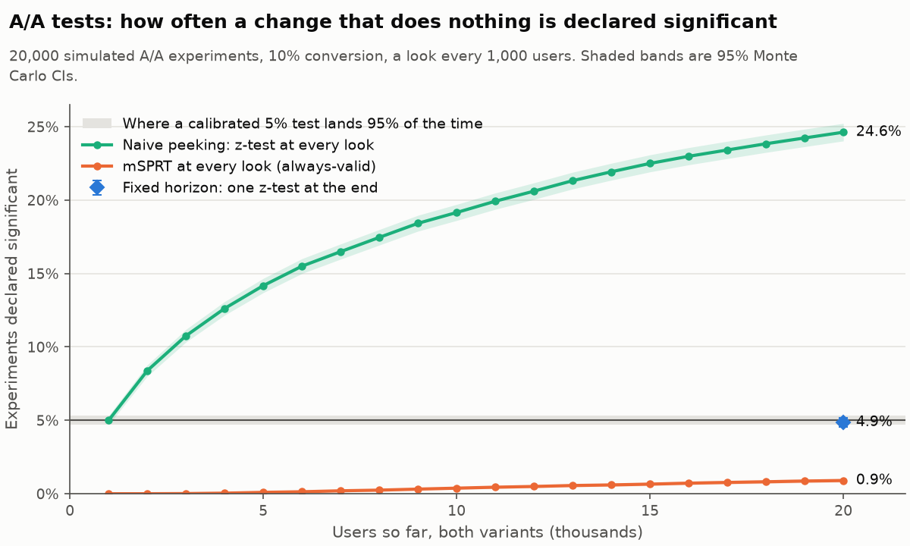
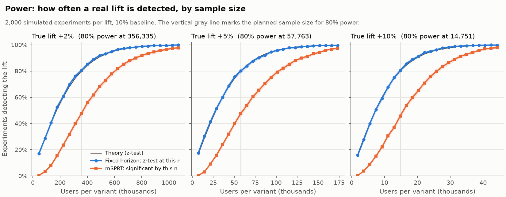
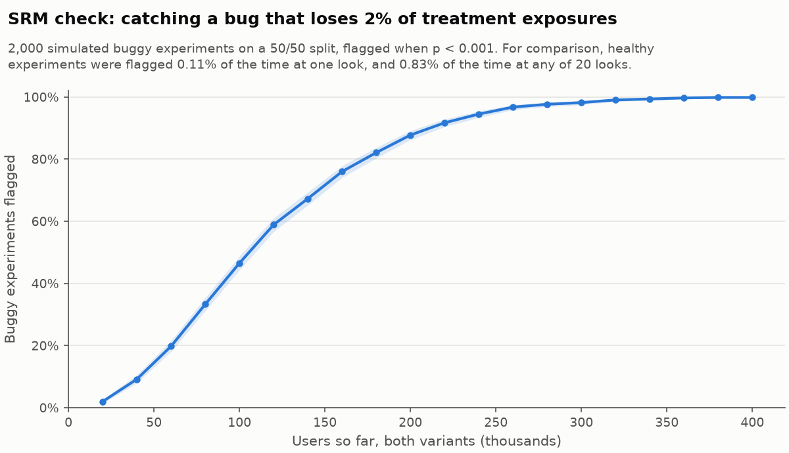
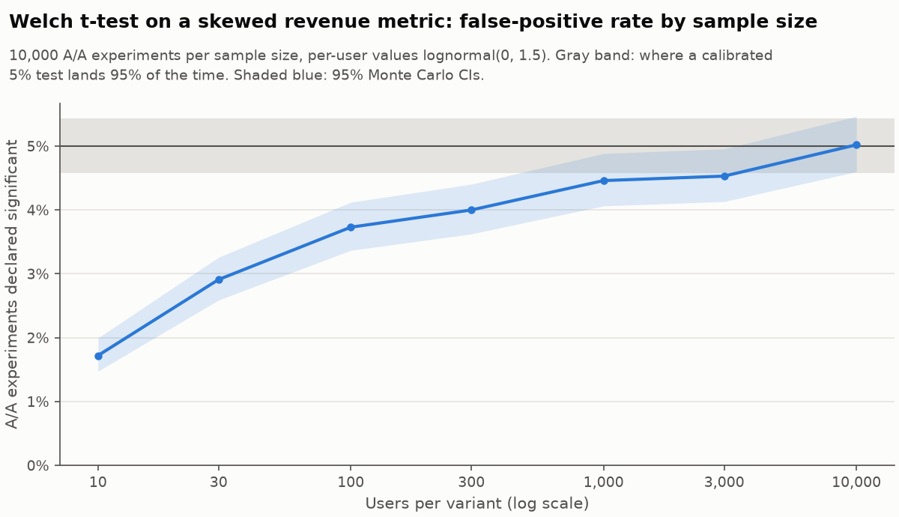

# Monte Carlo validation results

Generated by the simulator; do not edit by hand. Rerunning the same command reproduces these numbers exactly (same seed, same library versions).

- Command: `python -m abtest.simulator validate --seed 42`
- Seed: 42
- Runtime: 33 s on Darwin arm64, 10 CPUs, Python 3.14.7

## Acceptance checks (PRD §22, M2)

| Check | Result | |
|---|---|---|
| A/A fixed-horizon false-positive rate is inside the 95% range of a calibrated 5% test (4.70% to 5.30%) | 4.86% | PASS |
| A/A sequential (mSPRT) false-positive rate is at most 5%, within Monte Carlo error (at most 5.30%) | 0.90% | PASS |

## 1-3. A/A tests: fixed horizon, naive peeking, sequential

20,000 A/A experiments (both variants convert at 10%), with a look every 1,000 users (both variants together) for 20 looks, 20,000 users in total. alpha = 0.05. The mSPRT uses tau = baseline x MDE = 0.1 x 0.1 = 0.01. Rates are shown with exact 95% binomial CIs.

| Analysis | False-positive rate (95% CI) |
|---|---|
| Fixed horizon: one z-test after 20,000 users | 4.86% (4.57% to 5.17%) |
| Naive peeking: z-test at each of 20 looks, stop at the first p < 0.05 | 24.62% (24.03% to 25.23%) |
| mSPRT at each of 20 looks | 0.90% (0.77% to 1.04%) |

Naive peeking declares 4.9x as many false winners as the nominal rate.

## 4. Power: fixed horizon vs sequential

2,000 experiments per true lift, 10% baseline, alpha = 0.05, 24 looks. A detection is a significant win. tau = baseline x the true lift. Theory is the z-test's analytic power curve.

| True lift | Users per variant for 80% power | Fixed horizon at that n | Theory | mSPRT by that n | mSPRT first reaches 80% at |
|---|---|---|---|---|---|
| +2% | 356,335 | 80.40% (78.59% to 82.12%) at 356,336 | 80.00% | 47.50% (45.29% to 49.72%) | 623,588 (1.75x) |
| +5% | 57,763 | 80.10% (78.28% to 81.83%) at 57,764 | 80.00% | 47.60% (45.39% to 49.82%) | 108,307 (1.88x) |
| +10% | 14,751 | 80.40% (78.59% to 82.12%) at 14,752 | 80.00% | 45.70% (43.50% to 47.91%) | 27,660 (1.88x) |

## 5. Sample ratio mismatch

A bug loses 2% of treatment exposures on a 50/50 split. 2,000 buggy experiments; flagged when the chi-square p < 0.001.

| Users so far (both variants) | Buggy experiments flagged (95% CI) |
|---|---|
| 40,000 | 9.20% (7.97% to 10.55%) |
| 80,000 | 33.30% (31.24% to 35.41%) |
| 120,000 | 58.90% (56.71% to 61.07%) |
| 160,000 | 76.00% (74.07% to 77.86%) |
| 200,000 | 87.75% (86.23% to 89.16%) |
| 240,000 | 94.50% (93.41% to 95.46%) |
| 280,000 | 97.65% (96.89% to 98.27%) |
| 320,000 | 99.05% (98.52% to 99.43%) |
| 360,000 | 99.70% (99.35% to 99.89%) |
| 400,000 | 99.85% (99.56% to 99.97%) |

False alarms on 20,000 healthy 50/50 experiments, checked every 1,000 users up to 20,000:

- flagged at the final look: 0.11% (0.07% to 0.17%)
- flagged at any of the 20 looks: 0.83% (0.71% to 0.97%)

A per-look threshold of 0.001 is not a per-experiment false-alarm rate: an SRM check repeated on every snapshot has its own peeking problem.

## 6. Welch t-test on a skewed metric

10,000 A/A experiments per sample size; per-user values are lognormal(0, 1.5) in both variants. alpha = 0.05. A calibrated test lands in 4.58% to 5.43% 95% of the time.

| Users per variant | False-positive rate (95% CI) |
|---|---|
| 10 | 1.72% (1.47% to 1.99%) |
| 30 | 2.91% (2.59% to 3.26%) |
| 100 | 3.73% (3.37% to 4.12%) |
| 300 | 4.00% (3.62% to 4.40%) |
| 1,000 | 4.46% (4.06% to 4.88%) |
| 3,000 | 4.53% (4.13% to 4.96%) |
| 10,000 | 5.02% (4.60% to 5.47%) |

